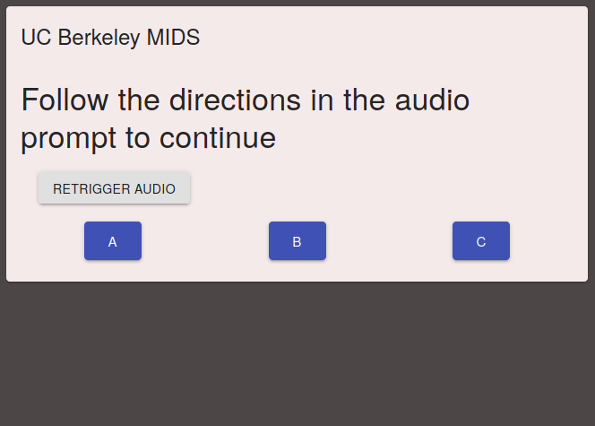

```{r,include=FALSE, results='hide'}
# clear out environment variables
rm(list=ls())

# set seed for randomization
set.seed(1)
```


```{r setup, include=FALSE}
knitr::opts_chunk$set(echo = TRUE)
library(tufte)
library(foreign)
library(data.table)
library(knitr)
library(dplyr)
library(ggplot2)
library(foreign)
library(zoo)
library(lmtest) # robust standard errors
library(sandwich) # robust standard errors
library(stargazer) # reporting formatted results
library(magrittr) # printing document
library(pwr) # estimating power
library(kableExtra)
```

```{r write repeatable functions, include=FALSE, results='hide'}
# show mean comply rates by assignment status in the pilot
complyratesbytreatment <- function(dt) { 
  return(dt[,.('mean_comply_rate'=mean(comply)),keyby=.(assignment_status)])
  }

# estimate treatment effect for the male voice treatment
ate_treatmentmale <- function(dt) {
  return(mean(dt[dt$assignment_status=='TM',]$comply)-mean(dt[dt$assignment_status=='C',]$comply))
}

# estimate treatment effect for the female voice treatment
ate_treatmentfemale <- function(dt) {
  return(mean(dt[dt$assignment_status=='TF',]$comply)-mean(dt[dt$assignment_status=='C',]$comply))
}

# estimate effect between male and female voice treatments
ate_treatment_btwnmalefemale <- function(dt) {
  return(mean(dt[dt$assignment_status=='TM',]$comply)-mean(dt[dt$assignment_status=='TF',]$comply))
}

# conduct a two-sample t-test between male audio treatment and control
t_test_result <- function(dt, treatment, control) {
  # vectors with bids for control and treatment groups
  optimal_t <- dt[dt$assignment_status==treatment, comply]
  optimal_c <- dt[dt$assignment_status==control, comply]
  return(t.test(optimal_t, optimal_c))
}

# regression of the comply rate on the assignment status with covariate adjustment for subject gender and age
reg <- function(data){
  data[,lm(comply_rate ~ as.factor(assignment_status)+gender+age)]
}

# regression of the comply rate on the assignment status with covariate adjustment for subject gender and age and interaction terms
reg_interaction <- function(data){
  data[,lm(comply_rate ~ as.factor(assignment_status)+gender+age+gender*as.factor(assignment_status)+age*as.factor(assignment_status))]
}

# report regression results with robust standard errors
reg_agg_robust <- function(data){
  reg <- data[,lm(comply_rate ~ as.factor(assignment_status)+gender+age)]
  return(coeftest(reg, vcovHC(reg, type='HC3')))
}

# report regression results with robust standard errors and interaction terms
reg_agg_robust_interaction <- function(data){
  reg <- data[,lm(comply_rate ~ as.factor(assignment_status)+gender+age+gender*as.factor(assignment_status)+age*as.factor(assignment_status))]
  return(coeftest(reg, vcovHC(reg, type='HC3')))
}

# regression of the comply rate on the assignment status with covariate adjustment for subject gender and age
# report regression results with clustered standard errors at subject ID level
reg_agg_clustered <- function(data){
  reg <- data[,lm(comply_rate ~ as.factor(assignment_status)+gender+age)]
  return(coeftest(reg, vcovCL(reg, cluster = data[ ,subject_id])))
}

# report regression results with clustered standard errors at subject ID level and interaction terms
reg_agg_clustered_interaction <- function(data){
  reg <- data[,lm(comply_rate ~ as.factor(assignment_status)+gender+age+gender*as.factor(assignment_status)+age*as.factor(assignment_status))]
  return(coeftest(reg, vcovCL(reg, cluster = data[ ,subject_id])))
}

# logistic regression of the comply rate on the assignment status with covariate adjustment for subject gender and age
logistic_reg <- function(data){
  data[,glm(comply ~ as.factor(assignment_status)+gender+age+as.factor(subject_id), family = "binomial")]
} 

# report logistic regression results with robust standard errors
logistic_reg_robust <- function(data){
  logistic <- data[,glm(comply ~ as.factor(assignment_status)+gender+age+as.factor(subject_id), family = "binomial")]
  return(coeftest(logistic,vcovHC(logistic, type='HC3')))
}

# report logistic regression results with clustered standard errors
logistic_reg_clustered <- function(data){
  logistic <- data[,glm(comply ~ as.factor(assignment_status)+gender+age+as.factor(subject_id), family = "binomial")]
  return(coeftest(logistic,vcovHC(logistic, cluster = data[ ,subject_id])))
}

# robust standard errors
robust_se <- function(mod, type = 'HC3') { 
  sqrt(diag(vcovHC(mod, type)))
}

# clustered standard errors
cluster_se <- function(mod, data) { 
  sqrt(diag(vcovCL(mod, cluster=data[,subject_id])))
}

```


> "I personally take the subway in New York. I love the subway because of the male and female voices that narrate the subway... 
> that man and that woman. The woman who does the subway announcements and her way too loud husband. 
> You know the woman who is like, (in a soft female voice) "The next stop is Christopher Street."
> (in a strong male voice) "STAND CLEAR OF THE CLOSING DOORS PLEASE!".
> I asked my friend who works for the city, why is it a male voice and a female voice. And he told me because it’s been proven 
> that people take information from a female voice, but they will only take a warning from a male voice. Now that’s its own 
> American gender nightmare that we don’t have time to get into…"
> `r tufte::quote_footer('--- @mulaney_2019')`

# Introduction
Implicit bias surrounding gender is ever-present in society and, in recent times, more attention has been brought to the issue. The increased attention has given rise to more effort to identify gender biases and attempt to mitigate and remove them. However, even with increased attention to the issue, gender biases persist in our everyday life - from the technologies we use such as voice assistants on smartphones and the audio commands in public service announcements. A CNN article (October 2011) discusses how the choice of the gendered voice of the Siri audio assistant in Apple I-Phone smartphone, which is female in the US market, has to do with biological studies that suggest that people generally find women's voices more pleasing than men's. The same article cites historical references such as the use of female voices in navigation devices during World War II, when women's voices were employed in airplane cockpits because they stood out among the male pilots. Moreover, “telephone operators have traditionally been female, making people accustomed to getting assistance from a disembodied woman's voice.” [@griggs_2011] Recent media reports also cite cases of women in high positions deepening their voices to sound more baritone in order to convey authority (for example, the case of Theranos CEO Elizabeth Holmes) [@hesse_2019]. With this motivation, we pursued identifying the existence of gender bias in giving directions through an experimental study.

## Research Question
The experimental study attempts to isolate the effects that a speaker’s gender has on the willingness of a targeted listener to follow through on the direction of the speaker. The purpose is to provide insight on whether the verbal directions of men are more effective than that of women in steering behavior though some simple game playing. The experiment should serve to examine the existence of the effect and the strength of the effect, if it exists. 

# Experimental Design
## Discussion of the Treatment
In order to estimate the effect of a gender bias in following directions, we designed an online tic-tac-toe game whereby participants hear audio directive cues to make play moves in gendered voices (male or female). The treatment is the audio directive to make a given move while playing tic-tac-toe against a computer adversary as well as a visual indicator over the suggested square to make a move. The control group receives no audio directive, but rather, a visual indicator over the suggested square to make a move. Audio (for the treatment) and visual (for the control) suggestions are provided randomly with some moves provided as optimal moves and other moves as random, likely sub-optimal, suggestions following a random process. 

There is one main measured outcome in the study: the proportion $p_{all}$ of all moves that the subject follows the recommendation of the directive over the course of playing the online tic-tac-toe games. While subjects randomly receive both strategically optimal and non-optimal moves, the main measured outcome attempts to capture the generalized treatment effect for all suggested moves. The treatment effect is the mean difference in outcomes between the treatment and control group, given the treatment is received. The experimental concern of interest is how the gender of the speaker affects the experimental subject’s willingness to listen in direct comparison to the control group’s willingness to listen.

As an extension, we also examined the treatment effects through the interplay of strategy and audio directives by examining: the proportion $p_{optimal}$ of moves that the subject follows the recommendation of the directive when the move is strategically optimal over the course of playing the online tic-tac-toe games; and the
proportion $p_{nonoptimal}$ of moves that the subject follows the recommendation of the directive when the move is not strategically optimal (but, rather random) over the course of playing the online tic-tac-toe games. Finally, we examined treatment effects for more micro-level strategy over the course of game play. We examined the
proportion $p_{bygame}$ of moves that the subject follows the recommendation of the directive in each ordered game over the course of playing the five online tic-tac-toe games (i.e. game 1, game 2, game 3, game 4 and game 5); and proportion $p_{bymove}$ of moves that the subject follows the recommendation of the directive in
each ordered move within a given game over the course of play (i.e. move 1, move 2, move 3).

Finally, we also examined the treatment effects on the likelihoods that a subject follows the recommendation of the directive for any given move through a logistic regression analysis.

## Comparison of Potential Outcomes
The potential outcomes are the proportion of moves made by an experimental subject that follow the directive suggestions in the course of tic-tac-toe game play. There are three types of potential outcomes in the experiment corresponding to the treatment assignments: control (no audio directive), treatment-female (female audio voice directive), and treatment-male (male audio voice directive). Those assigned to receive the control will see a visual suggestion with a square highlighted in the tic-tac-toe board. Formally, the potential outcomes in this study can be described as:

- $Y_i(TM=1)$: random variable representing the potential outcomes for a given experimental $i^{th}$ subject receiving the male voice audio treatment. 
- $Y_i(TF=1)$: random variable representing the potential outcomes for a given experimental $i^{th}$ subject receiving the female voice audio treatment. 
- $Y_i(T=0)$: random variable representing the potential outcomes for a given experimental $i^{th}$ subject receiving the control of no audio treatment, but rather a square highlighted in the tic-tac-toe board.

We can be assured through the construction of the online tic-tac-toe game and careful assignment process that those subjects assigned to the treatment groups will receive the treatment. In other words, those assigned to the treatment group, will not inadvertently not receive the control. Therefore, we can state that  the expected potential outcome for given subject randomly allocated to a treatment group is equal to the expected outcome for a given subject randomly allocated to a treatment group conditional on the subject actually receiving the treatment; formally, $E[Y_i(1)]$ = $E[Y_i(1)|d_i=1]$ for both the treatment-male and treatment-female voice recipients.

The average treatment effect (ATE) can be described as the difference in average outcomes in the treatment and control groups. Formally, this is written as:

The difference in average potential outcomes for subjects in the treatment-male group from the average potential outcomes for subjects in the control group:

$E[Y_i(TM=1)|D_i=1] - E[Y_i(T=0)|D_i=0]$

The difference in average potential outcomes for subjects in the treatment-female group from the average potential outcomes for subjects in the control group:

$E[Y_i(TF=1)|D_i=1] - E[Y_i(T=0)|D_i=0]$

Subjects are randomly assigned to treatment and control groups and therefore, there is no selection bias and we can say the ATE is unbiased. The ATE among randomly treated subjects is the same as the ATE among all subjects.  

We also compare the difference in average potential outcomes across the two treatment groups for further exposition; although this will be lower-powered as we discuss below. 

## Random Assignment
Randomization is done by taking all experimental subjects and assigning roughly half of participants to the control group and the other half to the treatment group, using the `sample` function in R. Given our suspicion that the gender of the experimental subject may influence how (s)he may respond to the treatment, a blocking design was used on the subject’s gender. In this blocking design, a roughly equal proportion of male subjects and female subjects were assigned randomly to treatment and control groups. Subjects in the treatment group were then further randomly assigned to treatment-male and treatment-female groups. 

The following R code demonstrates the randomization approach and subject gender-blocking approach: 

```{r read pre-treatment data, include=FALSE, results='hide'}
d <- fread('../data/pretreatmentresponses1.csv')
```

Set an `id` variable (ordinal) useful for randomization assignment, create a binary numerical gender variable, and rename the long variable names from the pre-treatment survey data.

```{r create data variables for analysis, include=TRUE, results='hide'}
d[,'id'] <- c(1:nrow(d))
colnames(d)[1:5] <-c("timestamp","gender_string","age","email","consent")
d[, gender:=ifelse(gender_string=='Female',0,1)]
dim(d)
```

Importantly, we check for any "No" consents. These would be excluded from the study.

```{r examine consent for the study, include=TRUE, results='hide'}
table(d$consent)
```

Examine the gender and age distibution. 

```{r gender and age distribution, include=TRUE}
#crosstab of gender
table(d$gender_string)

# summary statistics of age
summary(d$age, na.omit=FALSE)

# histogram of age
hist(as.numeric(d$age),main="Age distribution", xlab="Counts for age",
     ylab = "Frequency", breaks=50)

```

We find there are more men then women in the study (`r table(d$gender_string)[1]` females and `r table(d$gender_string)[2]` males). The age distribution is right-skewed with most subjects tending to be in their 30s (median of `r summary(d$age, na.omit=FALSE)[3]`).

Perform a block randomization on gender to assign treatment in approximately equal proportions to male and female subjects. 

```{r block randomization, include=TRUE}
# Assign count variables
N = nrow(d)
n_female <- length(d$age[d$gender==0])
n_male = length(d$age[d$gender==1])

#randomly assign subjects to either treatment or control groups blocking by state
randomize_blockbygender <- function(){
  ifelse(d$gender==1,sample(c(rep(0,n_female/2),rep(1,n_female/2))),
         sample(c(rep(0,n_male/2),rep(1,n_male/2))))
}

# create treatment assignment variable
d[,'treatment'] <- randomize_blockbygender()

#Check cross-tab of treatment and gender
kable(d[,xtabs(~gender+treatment)])
#kable(table(d$gender,d$treatment))
```


Split treatment group further into two treatment groups for female `TF` and male voice `TM`.

```{r treatment group split, include=TRUE}
# assign treatment count variable
n_treatment = length(d$age[d$treatment==1])

#randomly assign subjects to either two treatment groups (TF and TM)
randomize_treatment <- function(){
  ifelse(d$treatment==1,sample(c(rep(0,n_treatment/2),rep(1,n_treatment/2))),0)
}

d[,'is_treatedmalevoice'] <- randomize_treatment()

#Check cross-tab of treatment and is_treatedmalevoice
kable(table(d$is_treatedmalevoice,d$treatment))
```

For dataset readability purposes, include a string variable for each subjects assignment: control `C`, treatment with male voice `TM`, and treatment with female voice `TF`.

```{r create assignment variable, include=TRUE}
# create a string assignment variable for readability purposes
d[treatment==0, assignment:='C']
d[treatment==1 & is_treatedmalevoice==1, assignment:='TM']
d[treatment==1 & is_treatedmalevoice==0, assignment:='TF']

# check cross-tab
table(d$assignment)
```

Following the assignment randomization process, we examine the balance of the subject gender across the treatment and control groups. We find an appropriate level of gender balance across groups that should improve the power of our treatment effect estimates. The higher count of male subjects across all treatment assignment groups reflects the fact that there are more male subjects in the study overall; however, the gender balance is proportionally consistent across treatment assignment groups.

```{r distribution of gender covariate balance, include=TRUE}
# check cross-tab of assignment and subject gender
table(d$assignment, d$gender_string)

assignment.labs <- c("Control", "Treatment-Female Voice", "Treatment-Male Voice")
names(assignment.labs) <- c("C", "TF", "TM")

ggplot(d,aes(x=gender_string))+stat_count(width = 0.5)+ 
  facet_grid(~assignment, labeller = labeller(assignment = assignment.labs))+
  labs(title = 'Histograms of gender distribution by assignment group')+
  theme_bw()
```

Although we did not perform block randomization on age, we also examine the balance on age and observe an approximately similar balance, although the group assigned the female audio treatment skewed slightly younger. We did not think this had a meaningful impact on results.

```{r distribution of age covariate balance, include=TRUE}
# check cross-tab of assignment and age
table(d$assignment, d$age)

# examine age distributions across assignment groups

assignment.labs <- c("Control", "Treatment-Female Voice", "Treatment-Male Voice")
names(assignment.labs) <- c("C", "TF", "TM")

ggplot(d,aes(x=as.numeric(age)))+geom_histogram(bins=30)+ 
  facet_grid(~assignment, labeller = labeller(assignment = assignment.labs))+
  labs(title = 'Histograms of age distribution by assignment group')+
  theme_bw()
```

## Discussion on Attrition
There were 10 subjects that completed the pre-experiment survey, yet did not actually take the treatment by playing the games. As a result, we observed missing outcome data for these 10 subjects. We viewed this as an innocuous form of attrition since the missing data for the attriters is independent of potential outcomes (missing independent of potential outcomes, $Y_{i}(z) \perp \!\!\! \perp  R_{i}(z)$). This is satisfied by the research design since subjects were divided into random subgroups and outcomes were measured through different randomly assigned exposures unknown in advance. We observe that the attriters were approximately balanced across treatment assignment groups (2 in the control group, 4 in the male voice treatment and 4 in the female voice treatment) and therefore, we do not think that attrition is systematically related to a subject’s potential outcomes. Moreover, in performing a covariate balance check for these attriters, we find these subjects approximately balanced across covariates. See the plot of the gender and age distribution for attriters below. Give the benign nature of this attrition, we choose to exclude these subjects with missing outcomes in analyzing the experimental results. 

```{r read in final compliance rates data, include=FALSE, results='hide'}
compliance_rates <- fread('../data/compliance_rates_final.csv')
compliance_rates
```

```{r subset for attriters and non-attriters, include=FALSE, results='hide'}
final_attriters <- compliance_rates[experiment_status != 'C']
nrow(final_attriters)
final_compliers <- compliance_rates[experiment_status == 'C']
nrow(final_compliers)
```


```{r gender covariate balance check for attriters, include=TRUE}
# check cross-tab of assignment and subject gender
kable(table(final_attriters$assignment, final_attriters$gender))

assignment_status.labs <- c("Control", "Treatment-Female Voice", "Treatment-Male Voice")
names(assignment_status.labs) <- c("C", "TF", "TM")

ggplot(final_attriters,aes(x=gender))+stat_count(width = 0.5)+ 
  facet_grid(~assignment_status, labeller = labeller(assignment_status = assignment_status.labs))+
  labs(title = 'Histograms of gender distribution by assignment group')+
  theme_bw()
```


```{r age covariate balance check for attriters, include=TRUE}
# check cross-tab of assignment and age
kable(table(final_attriters$assignment, final_attriters$age))

# examine age distributions across assignment groups

assignment_status.labs <- c("Control", "Treatment-Female Voice", "Treatment-Male Voice")
names(assignment_status.labs) <- c("C", "TF", "TM")

ggplot(final_attriters,aes(x=age))+geom_histogram(bins=30)+ 
  facet_grid(~assignment_status, labeller = labeller(assignment_status = assignment_status.labs))+
  labs(title = 'Histograms of age distribution by assignment group')+
  theme_bw()
```


## Discussion on Non-Compliance
There are two possible forms of non-compliance: (1) not completing the full set of 5 tic-tac-toe games, and (2) choosing not to receive the treatment (i.e. not listen to the audio directive) when playing the game. 

The first form of non-compliance is concerning for the experiment if subjects not completing the 5 tic-tac-toe games are not randomly related with their potential outcomes. That is, those who did not complete the games might be related to their treatment status. We do not view this a concern in the experiment as we found no subjects that did not complete all five tic-tac-toe games once initiating game play. 

The second form of non-compliance here is subtle because we will not know if the participants choose to hear the directive or not (by keeping the audio down or off or listening to something else while playing), even if they complete the game. We do, however, have a screen prompt prior to game play where subjects are forced to verify that their audio is working before advancing to the game. The experiment requires experimental subjects to complete the game in isolation while online, therefore, as researchers, we have no way to tell whether the experimental subjects actually listen to the audio directives. This is a source of potential unobserved error that can undermine the observed treatment effect and a potential limitation of the study. 

From the issues that were self-reported in the post-treatment survey, we found that all audio-related issues were from the Control group. Since subjects in the Control group were not supposed to receive the audio voice treatment anyway, we find that this was a source of unobserved error that imperiled the study. 


## Discussion on Excludability
The exclusion restriction is not violated in this study since only the relevant causal agent is the receipt of the treatment. That is, potential outcomes in following suggested directives respond solely to the receipt of the treatment, not to the random assignment of the treatment. Since subjects play the online tic-tac-toe game in isolation and only receive the programmed treatment or control, subjects must only be exposed to the treatment or control. As the experiment has been designed, the same procedures are used to measure outcomes in the treatment and control groups. No other research activities have been performed other than the treatment of interest that differentially impacts treatment and control groups.

Discussion on non-interference
In our experiment, the potential outcomes $Y_{i}(d)$ will be assumed to be unaffected by the treatment of other subjects. Subjects are provided the treatment in isolation and play the online tic-tac-toe game without others around them. Moreover, since the suggested directives are random during game play, one subject’s treatment should not affect another subject’s outcomes. We can say that our experiment upholds the Stable Unit Treatment Value Assumption (SUTVA) or non-interference. 

However, non-interference may be violated if people conspire and speak to each other before, or even during game play. There is a remote possibility of a non-interference violation if, for example, subjects who live in the same household or work for the same company receive treatment and discuss the game dynamics among themselves. These subjects living or working together may infer that they are receiving different treatments and change their behavior in game play from what they otherwise would have had they played in isolation. In our study, there are nine subjects belonging to the same company (United Fire Group) and three people living in the same house. Furthermore, there are also five MIDS students that may be taking W241 or may have taken W241 in the past that may infer something implicitly about the treatment. Again, these students may have the possibility of discussing the treatment among themselves. However, given that we have not communicated who the participants are in this study, we can assume that communication among treated students in the experiment is a remote possibility. We can assume no interdependencies in game play strategy and the assignment of one subject has no consequences for outcomes of other subjects.

## CONSORT

The flow diagram starts with 72 subjects who signed up to participate in the study through outreach through social outlets by researchers. The 72 subjects were randomly allocated into three groups - control (no audio directive), treatment (male audio directive) and treatment (female audio directive) following a blocking design based on subject gender (male or female). Following the block randomization, roughly half of subjects were assigned to control (33 subjects) and the other half assigned to one of the treatment groups (39 subjects). Subjects assigned to treatment were randomly assigned to either the male audio directive treatment and female audio directive treatment (22 assigned to the male audio directive and 17 assigned to the female audio directive). Each subject was sent an email to play the series of tic-tac-toe games under their assigned experimental condition (control or treatment). The game play outcomes related to compliance to the directive, by move and overall compliance will be used for estimating the treatment effects. As discussed in the section on Attrition, ten subjects attrited from the randomized experiment.  


```{r assignment_diagram, fig.cap='Random Assignment Flow Chart', out.width='50%', fig.align='center', echo=FALSE, message=FALSE, warning=FALSE}

```


## Power Calculation
According to List et al. (2008), the power of a statistical test is the probability that it will correctly lead to the rejection of the null hypothesis (the probability of a Type II error is 1-power, and is equal to the probability of falsely not rejecting the null hypothesis). The idea behind the choice of optimal sample sizes in this scenario is that the sample sizes have to be just large enough so that the experimenter (1) does not falsely reject the null hypothesis that the population treatment and control outcomes are equal, i.e., commit a Type I error; and (2) does not falsely accept the null hypothesis when the actual difference is equal to $\delta$, i.e. commit a Type II error. A simple rule of thumb to maximize power given a fixed experimental budget naturally follows: the ratio of the sample sizes is equal to the ratio of the standard deviations of outcomes.


Prior to our experiment, we assumed that the hypothetical effect size to be achieved should be 0.5, whereby average compliance rate for those in the control is $p$=0.5 and average compliance rate for those in the treatment is $p$=1. We understand that this might be reaching a bit with this hypothetical effect size since an average compliance rate of $p$=1 is the most extreme upward bound. It is likely that the realized treatment effect will be smaller in the experiment.  Below we discuss the effect on power using smaller effect sizes and illustrate the strength of power over effect size-sample size space.

We compute the appropriate sample size for the given effect size, significance level and power using the test of proportions. 


```{r compute power given pre-treatment assumptions, include=TRUE, results='hide'}
# assume effectsize from the t_test_result
effectsize <- 0.5
# test of proportions
pwr.2p.test(h = effectsize, n = NULL , sig.level = .05, power = .6 )

```
 
Assuming a reasonable target power of 60%, significance level $\alpha$ = .05 and effect size of 0.5, we would need sample size of `r round(pwr.2p.test(h = effectsize, n = NULL , sig.level = .05, power = .6 )$n,0)` in both groups.


Following the pre-treatment survey, we were able to solicit participation from `r nrow(compliance_rates)` people. Given the known sample sizes in the study, assuming a hypothetical effect size of `r effectsize` and significance level $\alpha$ = .05, we can compute the power in the study as follows:

```{r compute power following pre-treatment survey, include=TRUE, results='hide'}
# number of observations in the control and treatment groups in the study
n_control = nrow(compliance_rates[compliance_rates$assignment_status=='C'])
n_treat = nrow(compliance_rates[compliance_rates$assignment_status!='C'])
n_treatmale = nrow(compliance_rates[compliance_rates$assignment_status=='TM'])
n_treatfemale = nrow(compliance_rates[compliance_rates$assignment_status=='TF'])

# compute the power for the overall control and combined treatment groups
pwr.2p2n.test(h = effectsize, n1 = n_control , n2 = n_treat , 
              sig.level = .05, power = NULL )

# compute the power for the overall control and male audio treatment groups
pwr.2p2n.test(h = effectsize, n1 = n_control , n2 = n_treatmale , 
              sig.level = .05, power = NULL )

# compute the power for the overall control and female audio treatment groups
pwr.2p2n.test(h = effectsize, n1 = n_control , n2 = n_treatfemale , 
              sig.level = .05, power = NULL )

```

Following the collecting of subjects in the pre-treatement survey phase, the power of our study would be expected to be `r round(pwr.2p2n.test(h = effectsize, n1 = n_control , n2 = n_treat , sig.level = .05, power = NULL)$power,2)*100` percent, suggesting a moderately-powered experiment.

If we consider the studies with the individual treatment effects (male and female audio) only, and assuming our hypothetical anticipated effect size, the power would have been `r round(pwr.2p2n.test(h = effectsize, n1 = n_control , n2 = n_treatmale , sig.level = .05, power = NULL)$power,2)*100` percent and `r round(pwr.2p2n.test(h = effectsize, n1 = n_control , n2 = n_treatfemale , sig.level = .05, power = NULL)$power,2)*100` percent for the male and female audio treatment studies, respectively.


```{r power curves visualization, include=FALSE, results='hide'}
# power values
p <- seq(.2,.9,.1)
np <- length(p)

# range of effect sizes
h <- seq(.2,1,.05)
nh <- length(h)

# obtain sample sizes
samsize <- array(numeric(nh*np), dim=c(nh,np))
for (i in 1:np){
  for (j in 1:nh){
    result <- pwr.2p.test(h = h[j], n = NULL , sig.level = .05, power = p[i])
    samsize[j,i] <- ceiling(result$n)
  }
}

# set up graph
xrange <- range(h)
yrange <- round(range(samsize))
colors <- rainbow(length(p))
plot(xrange, yrange, type="n",
  xlab="Effect size",
  ylab="Sample Size (n)" )

# add power curves
for (i in 1:np){
  lines(h, samsize[,i], type="l", lwd=2, col=colors[i])
}

# add annotation (grid lines, title, legend)
abline(v=0, h=seq(0,yrange[2],50), lty=2, col="grey89")
abline(h=0, v=seq(xrange[1],xrange[2],.02), lty=2,
   col="grey89")
title("Sample Size Estimation for Effect Size, Sig=0.05 (Two-tailed)")
legend("topright", title="Power", as.character(p),
   fill=colors)
```


In the actual study, accounting for attrition, we had `r nrow(final_compliers)` subjects in the experiment and therefore, could not achieve the power targeted prior to conducting the experiement. Moreover, as we discuss in the Results section, our treatment effects were substantially smaller than 0.5. We report the actual power of the experiment in the Results sub-section "Post-treatment power calculation".


# Data Collection
Subjects for our experiment were a collection of fellow students in the MIDS program, and the authors’ personal and professional acquaintances. Initial data collection involved sending out a pre-treatment survey in which the respondent is asked to provide their gender, age, and contact information. We use the data collected from this survey to inform our blocking strategy, as described above in the Randomization Process section. One additional step that was included was the creation of a pilot group, which we used to identify any technical bugs in our software infrastructure. This pilot group contained 9 randomly assigned subjects with proportional representation from the full-sized treatment groups, and received treatment before the remainder of the subject pool were contacted to receive treatment.

Treatment was administered via a custom designed web application. Emails were sent to the email addresses that were provided in the pre-treatment survey that contained links to the web application that were unique to the individual subjects, which allowed us to identify which subject was connecting to the web application. If the subject had not completed their assigned task within a week prior to the deadline listed in the email, an additional reminder email is sent out. The script of both of these emails can be found in the appendix.


```{r control_flow, fig.cap='Web-application control flow', out.width='50%', fig.align='center', echo=FALSE, message=FALSE, warning=FALSE}
knitr::include_graphics("./control_flow.png")
```


Upon arrival at the website, the user is greeted with a page that informs the subject that they are expected to fully complete the game, and navigation away from the game will invalidate their results. Those in either treatment group are shown a button which allows them to test their audio. On advancing to the next page of the website, subjects in the treatment group are also greeted with an additional audio test, which requires them to select a button on screen that corresponds to a verbal direction. Subjects in the treatment group are not allowed to advance to subsequent screens if they do not pass this audio validation check. The next page then notifies the user of the game that they will play, and informs them that the move suggestions that they receive may or may not be optimal.


```{r audio_verification, fig.cap='Screenshot of the audio verification page', out.width='50%', fig.align='center', echo=FALSE, message=FALSE, warning=FALSE}

```


```{r game, fig.cap='Screenshot of the tic-tac-toe game', out.width='50%', fig.align='center', echo=FALSE, message=FALSE, warning=FALSE}

```

Once in the game, the users were tasked with completing five games of tic-tac-toe. The opening move alternated between computer and player, with the player getting the opening move in the first game. On each of the subject’s turns, a suggested cell is highlighted to a different color than the other cells. This suggested move is either (with equal probability):
the optimal move as determined by a Minimax decision rule, or 
a randomly selected available cell on the board

This approach for suggesting a position was taken in order to discourage the subject from assuming the suggestions are always optimal or never optimal. The computer opponent follows the same strategy when making their selection. If the subject is in either treatment group, an audio clip is played with a verbal direction to move to the highlighted cell with the gender of the speaker corresponding to the treatment group that the subject belongs to. On the player’s selection of their next move the current board state, selected position, suggested position, and whether the suggested position was optimal are all recorded.

On completion of five games, the subjects are brought to a final screen which thanks them for participating and contains a link to a post-experiment survey. This survey’s results were used to identify any technical glitches and inform some retrospective analysis of the experiment design.

# Model
The main model of our analysis investigates the suggested move compliance rate of the subject dependent on whether the subject was in the control or one of the treatment groups. Our models can be expressed formally as:

- Linear model without interaction terms:

$$Y = \beta_{1}maleaudio + \beta_{2}femaleaudio + \beta_{3}gender + \beta_{4}age$$

- Linear model with interaction terms:

$Y = \beta_{1}maleaudio + \beta_{2}femaleaudio +
      \beta_{3}gender + \beta_{4}age + \beta_{5}maleaudio*gender +
      \beta_{6}femaleaudio*gender + \beta_{7}maleaudio*age +
      \beta_{8}femaleaudio*age$

- Logistic regression model without interaction terms:

$$P(Y=1) = \beta_{1}maleaudio + \beta_{2}femaleaudio + \beta_{3}gender + \beta_{4}age$$

or expressed in log-odds as:

$$LL = ln(\frac{p}{1-p})=\beta_{1}maleaudio + \beta_{2}femaleaudio + \beta_{3}gender + \beta_{4}age$$


We estimated causal effects using the postulated  models over a sequence of analyses:

1. Proportional compliance to suggested moves for all moves 
2. Move-by-move compliance to suggested moves on a move-by-move basis for all moves (using logistic regression)
3. Proportional compliance to suggested moves for optimal and non-optimal suggested moves
4. Proportional compliance to suggested moves for all moves by subject gender
5. Proportional compliance to suggested moves by order of game
6. Proportional compliance to suggested moves by order of move

Each of these estimates causal effects in an attempt to more fully comprehend the dynamic between move suggestions and game play strategy.

# Model Results

## Proportional compliance to suggested moves for all moves

We find the compliance to suggested moves are higher for the gendered voice treatment groups with a slightly larger compliance rates for the female audio voice. The table below shows the compliance rates to suggested moves by assignment status. 

```{r functions to estimate comply rates for all moves, include=FALSE}

# show mean comply rates by assignment status in the pilot
complyrates <- function(dt) { 
  return(dt[,.('mean_comply_rate'=mean(comply_rate)),keyby=.(assignment_status)])
  }

# estimate treatment effect for the male voice treatment
ate_tm <- function(dt) {
  return(mean(dt[dt$assignment_status=='TM',]$comply_rate)-mean(dt[dt$assignment_status=='C',]$comply_rate))
}

# estimate treatment effect for the female voice treatment
ate_tf <- function(dt) {
  return(mean(dt[dt$assignment_status=='TF',]$comply_rate)-mean(dt[dt$assignment_status=='C',]$comply_rate))
}

ate_tm_lbl <- 'ATE for Male Treatment for all moves:'
ate_tf_lbl <- 'ATE for Female Treatment for all moves:'

ate_tm <- round(ate_tm(dt=final_compliers),3)
ate_tf <- round(ate_tf(dt=final_compliers),3)

```


```{r comply rates to all moves by assignment status, include=TRUE}
kable(complyrates(dt=final_compliers))

```


The estimated treatment effects are larger for the female audio voice treatment as seen from the table below.

```{r estimate treatment effects for all moves, include=TRUE}
kable(cbind(c(ate_tm_lbl, ate_tf_lbl),c(ate_tm, ate_tf)))
```

The ATE for the female audio treatment of `r round(ate_tf,2)` is greater than the ATE for the male audio treatment of `r round(ate_tm,2)`.

The regression table below reports the model estimates, first with no covariates, then with additional covariates with both robust standard errors, and clustered standard errors. We clustered on subject identifier since each subject received one treatment throughout game play.

```{r estimate regressions - naive and with covariates, include=FALSE, results='hide'}
# naive regression of the comply rate on the assignment status 
naive_reg <- final_compliers[,lm(comply_rate ~ as.factor(assignment_status))]

# estimate robust standard errors
naive_reg$vcovHC_ <- vcovHC(naive_reg , type='HC0')
naive_reg$robustse <- sqrt(diag(naive_reg $vcovHC_))

## one way clustering by subject id variable
naive_reg$vcovCL1_ <- vcovCL(naive_reg, cluster = final_compliers[ , subject_id])
naive_reg$cluster1se <- sqrt(diag(naive_reg$vcovCL1_))

# regression of the comply rate on the assignment status with covariate adjustment for subject gender and age
reg <- final_compliers[,lm(comply_rate ~ as.factor(assignment_status)+gender+age)]
                      #+ gender*as.factor(assignment_status) + age*as.factor(assignment_status))]

reg_interaction <- final_compliers[,lm(comply_rate ~ as.factor(assignment_status)+gender+age + gender*as.factor(assignment_status) + age*as.factor(assignment_status))]
#summary(reg_pilot1)

## one way clustering by subject id variable
reg$vcovCL1_ <- vcovCL(reg, cluster = final_compliers[ , subject_id])
reg_interaction$vcovCL1_ <- vcovCL(reg_interaction, cluster = final_compliers[ , subject_id])

# save the clustered standard errors
reg$cluster1se <- sqrt(diag(reg$vcovCL1_))
reg_interaction$cluster1se <- sqrt(diag(reg_interaction$vcovCL1_))

# estimate robust standard errors
reg$vcovHC_ <- vcovHC(reg, type='HC0')
reg$robustse <- sqrt(diag(reg$vcovHC_))
reg_interaction$vcovHC_ <- vcovHC(reg_interaction, type='HC0')
reg_interaction$robustse <- sqrt(diag(reg_interaction$vcovHC_))

# show regression results with robust standard errors
coeftest(reg, reg$vcovHC_)

# show regression results with clustered standard errors
coeftest(reg, reg$vvcovCL1_)

```


```{r stargazer of regression results, include=TRUE}
# report the formatted regression results
stargazer(naive_reg, reg, reg, reg_interaction, reg_interaction,
          type = 'text', title="Main regression results for all move suggestions",
          align=TRUE, dep.var.labels=c("Proportional compliance rate with suggested moves"),
          covariate.labels=c("Treatment-Female","Treatment-Male","Male gender",
                                "Age","TF-Male","TM-Male","TF-Age","TM-Age"),
          se=list(naive_reg$robustse, 
                    reg$robustse, 
                    reg$cluster1se,
                    reg_interaction$robustse, 
                    reg_interaction$cluster1se),
          add.lines = list(c('SE', 'Robust', 'Robust', 'Clustered', 
                             'Robust', 'Clustered')),
          no.space = FALSE,table.placement="t",
          omit.stat = c('ser', 'F'),
          column.sep.width = "0.1pt",
          header=F)
```


From the above plot, we see that voice directives have a statistically significant and positive effect on the willingness of a subject to take the move that was directed. We also see that the female speaker’s voice has a stronger effect on subject move compliance. The female voice treatment has coefficient estimate of `r round(coeftest(reg, reg$vcovCL1_)[2],2)` (with robust standard error of `r round(coeftest(reg, reg$vcovCL1_)[2,2],2)`). The male voice treatment has a coefficient estimate of `r round(coeftest(reg, reg$vcovCL1_)[3],2)` (with robust standard error of `r round(coeftest(reg, reg$vcovCL1_)[3,2],2)`).The coefficient for the age variable does indicate a very small, yet statistically significant, negative effect on the willingness to listen. The coefficient for gender is positive, but insignificant. 

However, after including the interaction terms between gender and the treatment assignments and age and the treatment assignments, the coefficients for the treatments are no longer statistically significant. We observe that the standard errors increase with the inclusion of the interaction terms due to the collinearity between the interaction terms and the stand-alone covariates, male and female treatment assignment, gender and age. This is because the residual variance falls only slightly with the inclusion of the interaction terms, while the standard deviation of $\tilde{X}_{ki}$ increases (the residual of the regression of $X_{ki}$ on all other regressors). Only the coefficient on the `age` variable remains statistically significant across all regression specifications, although it is practically insignificant in size.

We conducted a two-sample proportional t-test to observe that the difference between male and female voice directives is not statistically significant. We caution that the sample sizes are too small to render any meaningfully power to these effects. See the R code below for the t-test. 

```{r ttest compute, include=FALSE}
# vectors with bids for control and treatment groups
final_tm <- final_compliers[final_compliers$assignment_status=='TM', comply_rate]
final_tf <- final_compliers[final_compliers$assignment_status=='TF', comply_rate]
final_c <- final_compliers[final_compliers$assignment_status=='C', comply_rate]
final_t <- final_compliers[final_compliers$assignment_status!='C', comply_rate]

# conduct a two-sample t-test and save results to t_test_result variable
t_test_result_tm <- t.test(final_tm, final_c)
t_test_result_tf <- t.test(final_tf, final_c)
t_test_result_t <- t.test(final_tm, final_tf)
```


```{r report ttest results, include=TRUE, hide='results'}
t_test_result_tm
t_test_result_tf
t_test_result_t
```

Consistent with the regression results, we observe that the treatment effects for the male and female audio voice treatments are statistically different from zero with a p-value in their respective two sample t-tests of `r round(t_test_result_tm$p.value,4)` and `r round(t_test_result_tf$p.value,4)`, respectively. The treatment effect between the gendered voice treatments is statistically insignificant with a p-value in the t-test of `r round(t_test_result_t$p.value,4)`.  

## Evaluation of compliance with suggestions on a move-by-move basis

We examined the effects of a speaker giving voice directives on the likelihood of compliance with a given suggested move. Instead of the outcome being the proportion of all moves complied with, the outcome in this analysis is the binary outcome of compliance (0 or 1) for a given move suggestion. We estimated a logistic regression of the binary comply outcome on the treatment assignment status adjusting for the subject gender and age covariates and with subject id-level fixed effects might tell a more nuanced story. Report results with both robust standard errors and clustering at the subject ID level. Clustering at the subject ID level is important since the number of the moves (and therefore, number of observations) may differ across subjects. Clustering ensures that the standard errors reflects the tighter variation introduced at the subject identifier level. The table below shows the logistic regression results reporting coefficients as logits. 


```{r read in all moves dataset and create subsets for optimal and non-optimal suggested moves, include=FALSE}
all_moves <- fread('../data/all_moves_final.csv')

# create a binary comply variable for if suggested move was taken or not
all_moves[, comply:=ifelse((suggested_move_row==move_taken_row)&(suggested_move_column==move_taken_column),1,0)]

# filter out compliers in the study and optimal suggested moves
all_moves_optimal <- all_moves[(experiment_status == 'C') & (is_suggested_move_optimal==TRUE)]
all_moves_nonoptimal <- all_moves[(experiment_status == 'C') & (is_suggested_move_optimal==FALSE)]

# number of rows
nrow(all_moves_optimal)
nrow(all_moves_nonoptimal)
```  

```{r logistic regression results omitting subject_id coefficients in output, include=TRUE}
# report the formatted regression results
stargazer(logistic_reg(data=all_moves), logistic_reg(data=all_moves),
          type = 'text', 
          se = list(robust_se(logistic_reg(data=all_moves)), 
                    cluster_se(logistic_reg(data=all_moves),all_moves)),
          covariate.labels=c("Treatment-Female","Treatment-Male",
                             "Male gender","Age"),
          add.lines = list(c('Fixed Effects','Yes','Yes'),
                           c('SE', 'Robust', 'Clustered')),
          omit.stat = c('ser', 'F'),
          omit = c("subject_id"),
          no.space = TRUE,align=TRUE,table.placement="H",
          header=F)

```


Exponentiating the coefficients, we can interpret the likelihoods of compliance with suggested moves as odds-ratios. We find that the female audio treatment effect increases odds of compliance with a suggested move by an infinite factor $`r round(exp(coef(logistic_reg(all_moves))[2]),2)`$, controlling for covariates and fixed effects. The male audio treatment effect increases odds of compliance with a suggested move by a factor of `r round(exp(coef(logistic_reg(all_moves))[3]),2)`. Being a male subject increases odds of compliance with a suggested move by a factor of `r round(exp(coef(logistic_reg(all_moves))[4]),2)`. 

This model appears to reinforce the findings of the previous model, which is that audio directives are much more likely to be followed than visual directives. Female speakers has a stronger positive effect (larger odds of eliciting compliance with the suggested move directive).

## Evaluation of compliance to suggested optimal verses non-optimal moves 

As discussed in the Experimental Design section, subjects randomly received optimal and non-optimal move suggestions throughout game play. In order to assess whether the main results were consistent for the optimal and non-optimal move suggestions, we estimated the treatment effects on the subset of the data corresponding to the two type of move suggestions. 


First, as a diagnostic check, we look at the distribution of the proportion of optimal moves received by each subject. Some subject received more optimal moves than others, but distribution of proportion of optimal suggested moves by subject should be broadly symmetric since move suggestions were random.

```{r collapse dataset for mean optimal moves received by subject, include=FALSE, results='hide'}
# collapse the dataset by mean optimal move
all_moves_agg <- all_moves[experiment_status == 'C', list(mean_optimal_move=mean(is_suggested_move_optimal, na.rm=T)), keyby=subject_id]

# cross tab subject id and boolean value for optimal move suggestion
table(all_moves$subject_id, all_moves$is_suggested_move_optimal)
```


```{r distribution of optimal moves for each subject, include=TRUE}
hist(all_moves_agg$mean_optimal_move, main="Histogram of proportion of suggested optimal moves", 
     xlab="Proportion of suggested optimal moves", ylab = "Frequency", breaks=50)
```

Second, as further diagnostic check, the histograms below show the distribution of the proportion of compliance to optimal verses non-optimal suggested moves. The distribution is more right-skewed for the optimal moves than for non-optimal moves. As we would expect a priori, there is a tendency for higher rates of compliance to optimal moves than non-optimal suggested moves. 

```{r collapse dataset for mean proportional compliance to optimal verse non-optimal moves by subject, include=FALSE, results='hide'}
# collapse the dataset by mean optimal move compliance
optimal_moves_agg <- all_moves_optimal[experiment_status == 'C', 
                                       list(comply_rate=mean(comply, na.rm=T), 
                                       assignment_status=unique(assignment_status), 
                                       gender=unique(gender), age=unique(age)), keyby=subject_id]

# collapse the dataset by mean non-optimal move compliance
nonoptimal_moves_agg <- all_moves_nonoptimal[experiment_status == 'C', 
                                             list(comply_rate=mean(comply, na.rm=T), 
                                             assignment_status=unique(assignment_status), 
                                             gender=unique(gender), age=unique(age)), keyby=subject_id]

# show snapshot of aggregated dataset
head(optimal_moves_agg)
nrow(optimal_moves_agg)
head(nonoptimal_moves_agg)
nrow(nonoptimal_moves_agg)

```


```{r distribution of mean proportional compliance to optimal and non-optimal moves for each subject, include=TRUE}
par(mfrow=c(2,1))

# show distribution of compliance rates by subject
hist(optimal_moves_agg$comply_rate, 
     main="Histogram of compliance rates by subject for optimal moves", 
     xlab="Proportional rates of compliance", ylab = "Frequency", breaks=50)

# show distribution of non-compliance rates by subject
hist(nonoptimal_moves_agg$comply_rate,
     main="Histogram of compliance rates by subject for non-optimal moves", 
     xlab="Proportional rates of compliance", ylab = "Frequency", breaks=50)
```

We find the compliance to suggested optimal moves are higher across all treatment groups. See the tables for the compliance rates by assignment status below. 

```{r estimate comply rates, include=TRUE}
par(mfrow=c(1,2))
# report compliance rates across all treatment groups
print("Proportional compliance rates for optimal moves")
kable(complyratesbytreatment(dt=all_moves_optimal))

print("Proportional compliance rates for non-optimal moves")
kable(complyratesbytreatment(dt=all_moves_nonoptimal))
```

However, the estimated treatment effects are larger for the non-optimal move suggestions. This gives evidence that people are differentially listening to the audio when making their moves strategically over the course of play. 


```{r estimate treatment effects, include=FALSE}
ate_optimal_m_lbl <- 'ATE for Male Treatment over optimal moves:'
ate_optimal_f_lbl <- 'ATE for Female Treatment over optimal moves:'
ate_nonoptimal_m_lbl <- 'ATE for Male Treatment over nonoptimal moves:'
ate_nonoptimal_f_lbl <- 'ATE for Female Treatment over nonoptimal moves:'

ate_optimal_m <- round(ate_treatmentmale(dt=all_moves_optimal),3)
ate_optimal_f <- round(ate_treatmentfemale(dt=all_moves_optimal),3)
ate_nonoptimal_m <- round(ate_treatmentmale(dt=all_moves_nonoptimal),3)
ate_nonoptimal_f <- round(ate_treatmentfemale(dt=all_moves_nonoptimal),3)

```


```{r estimate treatment effects tables, include=TRUE}

kable(cbind(c(ate_optimal_m_lbl, ate_nonoptimal_m_lbl),
      c(ate_optimal_m, ate_nonoptimal_m)))

kable(cbind(c(ate_optimal_f_lbl, ate_nonoptimal_f_lbl),
      c(ate_optimal_f, ate_nonoptimal_f)))

```


Below we report the linear model estimates in two separate tables for optimal and non-optimal moves. Each table shows estimates in the first column with gender and age covariates reporting robust standard errors, second column with clustered standard errors (clustering on subject identifier), third column with interaction terms reporting robust standard errors, and fourth column with interaction terms with clustered standard errors (clustering on subject identifier). 

```{r estimate optimal moves regression, include=FALSE}

# regression of the comply rate on the assignment status with covariate adjustment for subject gender and age
reg <- function(data){
  data[,lm(comply_rate ~ as.factor(assignment_status)+gender+age)]
}

# regression of the comply rate on the assignment status with covariate adjustment for subject gender and age and interaction terms
reg_interaction <- function(data){
  data[,lm(comply_rate ~ as.factor(assignment_status)
           +gender+age+gender*as.factor(assignment_status)+age*as.factor(assignment_status))]
}

reg_optimal <- reg(data=optimal_moves_agg)
reg_interaction_optimal <- reg_interaction(data=optimal_moves_agg)
```


```{r linear model for the optimal moves subset, include=TRUE}
# report the formatted regression results
stargazer(reg_optimal, reg_optimal, reg_interaction_optimal, reg_interaction_optimal,
          type = 'text', 
          se = list(robust_se(reg(data=optimal_moves_agg)), 
                    cluster_se(reg(data=optimal_moves_agg),optimal_moves_agg),
                    robust_se(reg_interaction(data=optimal_moves_agg)), 
                    cluster_se(reg_interaction(data=optimal_moves_agg),optimal_moves_agg)),
          covariate.labels=c("Treatment-Female","Treatment-Male","Male gender",
                                "Age","TF-Male","TM-Male","TF-Age","TM-Age"),
          add.lines = list(c('Move Type', 'Optimal', 'Optimal', 'Optimal', 'Optimal'),
                           c('SE', 'Robust', 'Clustered', 'Robust', 'Clustered')),
          omit.stat = c('ser', 'F'),
          no.space = TRUE,align=TRUE,table.placement="H",
          header=F)
```


```{r linear model for the nonoptimal moves subset, include=TRUE}
# report the formatted regression results
stargazer(reg(data=nonoptimal_moves_agg), reg(data=nonoptimal_moves_agg), 
          reg_interaction(data=nonoptimal_moves_agg), reg_interaction(data=nonoptimal_moves_agg),
          type = 'text', 
          se = list(robust_se(reg(data=nonoptimal_moves_agg)), 
                    cluster_se(reg(data=nonoptimal_moves_agg),nonoptimal_moves_agg),
                    robust_se(reg_interaction(data=nonoptimal_moves_agg)), 
                    cluster_se(reg_interaction(data=nonoptimal_moves_agg),nonoptimal_moves_agg)),
          covariate.labels=c("Treatment-Female","Treatment-Male","Male gender",
                                "Age","TF-Male","TM-Male","TF-Age","TM-Age"),
          add.lines = list(c('Move Type', 'Nonoptimal', 'Nonoptimal', 'Nonoptimal', 'Nonoptimal'),
                           c('SE', 'Robust', 'Clustered', 'Robust', 'Clustered')),
          omit.stat = c('ser', 'F'),
          no.space = TRUE,align=TRUE,table.placement="H",
          header=F)
```


When breaking out comparison down by the optimal and non-optimal moves, we still see that the directives delivered by audio lead to a higher and statistically significant move compliance rate regardless of whether the move is optimal or not. This further supports our initial findings that compliance rates differ between audio and visual directions. We note that the effect is stronger in size for the non-optimal moves for both gendered voices, suggesting that subjects listen regardless of game strategy Compare the size of the coefficient estimates for the female and male audio treatments, respectively, (`r round(reg(data=optimal_moves_agg)$coefficients[2],2)` and `r round(reg(data=optimal_moves_agg)$coefficients[3],2)`) for optimal moves verses nonoptimal moves (`r round(reg(data=nonoptimal_moves_agg)$coefficients[2],2)` and `r round(reg(data=nonoptimal_moves_agg)$coefficients[3],2)`). 


When examining the comparison between the speaker’s gender, we see again that there is a slightly higher treatment effect for the female speaker, but the difference in effect sizes is not statistically significant following a two-sample t-test.

```{r twosample ttest, include=FALSE}
# conduct a two-sample t-test and save results to t_test_result variable
t_test_result_optimal_tm <- t_test_result(all_moves_optimal, 'TM', 'C')
t_test_result_optimal_tf <- t_test_result(all_moves_optimal, 'TF', 'C')
t_test_result_optimal_t <- t_test_result(all_moves_optimal, 'TM', 'TF')

t_test_result_nonoptimal_tm <- t_test_result(all_moves_nonoptimal, 'TM', 'C')
t_test_result_nonoptimal_tf <- t_test_result(all_moves_nonoptimal, 'TF', 'C')
t_test_result_nonoptimal_t <- t_test_result(all_moves_nonoptimal, 'TM', 'TF')

```


```{r ttest for optimal and nonoptimal suggested moves, include=TRUE}
t_test_result_optimal_tm
t_test_result_optimal_tf
t_test_result_optimal_t 

t_test_result_nonoptimal_tm
t_test_result_nonoptimal_tf
t_test_result_nonoptimal_t 
```

Consistent with the regression results, from the t-tests we observe that the treatment effect for the male voice and female voice treatments for the optimal moves are statistically different from zero with a p-value in the t-test of `r round(t_test_result_optimal_tm$p.value,4)` and `r round(t_test_result_optimal_tf$p.value,4)`, respectively. We observe similar effects from the t-tests for the non-optimal moves with p-values of `r round(t_test_result_nonoptimal_tm$p.value,4)` and `r round(t_test_result_nonoptimal_tf$p.value,4)`, respectively. The effect between the gendered voice treatments for both optimal and non-optimal moves is statistically insignificant with a p-value in the t-test of `r round(t_test_result_optimal_t$p.value,4)` and `r round(t_test_result_nonoptimal_t$p.value,4)`. 

## Evaluation of compliance to suggested moves based on gender of subject 

We block randomized subjects into treatment assignments by their gender. This design has the benefit of allowing us to estimate treatment effects for each block. Therefore, we estimated the treatment effects on the subset of the data corresponding to the male and female subjects separately. Below, we report the regression table from our postulated model where the outcome remains the proportional compliance rates. Columns 1 and 2 show the results for the male subjects only (with robust and clustered standard errors, respectively), while columns 3 and 4 show the results for the female subjects only (also with robust and clustered standard errors, respectively).

$Y = \beta_{1}maleaudio + \beta_{2}femaleaudio + \beta_{3}age$

```{r create aggregated dataset by subject gender, include=FALSE}
# create datasets
all_moves_male <- all_moves[gender=='M']
all_moves_female <- all_moves[gender=='F']

# collapse the datasets by mean compliance by subject ID
all_moves_male_agg <- all_moves_male[experiment_status == 'C', 
                                     list(comply_rate=mean(comply, na.rm=T),
                                          assignment_status=unique(assignment_status), 
                                          gender=unique(gender), age=unique(age)), keyby=subject_id]

all_moves_female_agg <- all_moves_female[experiment_status == 'C', 
                                         list(comply_rate=mean(comply, na.rm=T),
                                         assignment_status=unique(assignment_status), 
                                         gender=unique(gender), age=unique(age)), keyby=subject_id]

```

```{r estimate regressions, include=FALSE}
reg_male <- all_moves_male_agg[,lm(comply_rate ~ as.factor(assignment_status)+age)]
reg_female <- all_moves_female_agg[,lm(comply_rate ~ as.factor(assignment_status)+age)]

# estimate robust standard errors
reg_male$vcovHC_ <- vcovHC(reg_male, type='HC3')
reg_male$robustse <- sqrt(diag(reg_male$vcovHC_))
reg_female$vcovHC_ <- vcovHC(reg_female, type='HC3')
reg_female$robustse <- sqrt(diag(reg_female$vcovHC_))

## one way clustering by subject id variable
reg_male$vcovCL1_ <- vcovCL(reg_male, cluster = all_moves_male_agg[ , subject_id])
reg_male$cluster1se <- sqrt(diag(reg_male$vcovCL1_))
reg_female$vcovCL1_ <- vcovCL(reg_female, cluster = all_moves_female_agg[ , subject_id])
reg_female$cluster1se <- sqrt(diag(reg_female$vcovCL1_))

# save regression equations
reg_male <- all_moves_male_agg[,lm(comply_rate ~ as.factor(assignment_status)+age)]
reg_female <- all_moves_female_agg[,lm(comply_rate ~ as.factor(assignment_status)+age)]
```


```{r report regression results, include=TRUE}
stargazer(reg_male, reg_male,reg_female,reg_female,
          type = 'text', 
          se = list(robust_se(reg_male),
                    cluster_se(reg_male,all_moves_male_agg),
                    robust_se(reg_female),
                    cluster_se(reg_female,all_moves_female_agg)),
          add.lines = list(c('Subject Gender','Male','Male','Female','Female'),
                           c('SE', 'Robust', 'Clustered','Robust','Clustered')),
          covariate.labels=c("Treatment-Female","Treatment-Male","Age"),
          omit.stat = c('ser', 'F'),
          header=F)
```

We find that the treatment effects of the gendered audio voices are statistically significant for the male subjects only. For the male subjects, the treatment effect from the female audio voice is `r round(coeftest(reg_male,reg_male$vcovHC_)[2],3)` with robust standard error of `r round(coeftest(reg_male,reg_male$vcovHC_)[2,2],3)`, while for the male audio voice the estimated treatment effect is `r round(coeftest(reg_male,reg_male$vcovHC_)[3],3)` with robust standard error of `r round(coeftest(reg_male,reg_male$vcovHC_)[3,2],3)`.

For the female subjects, the treatment effects are statistically insignificant. The effect from female audio voice is `r round(coeftest(reg_female,reg_female$vcovHC_)[2],3)` with robust standard error of `r round(coeftest(reg_female,reg_female$vcovHC_)[2,2],3)`, while for the male audio voice the estimated treatment effect is `r round(coeftest(reg_female,reg_female$vcovHC_)[3],3)` with robust standard error of `r round(coeftest(reg_female,reg_female$vcovHC_)[3,2],3)`.

## Evaluation of compliance to suggested moves based on order of game 

As an ancillary analysis to assess how the game strategy interplays with the audio directives, we estimated the treatment effects by game number. This would theoretically allow us to observe whether there is a trend in compliance rates as the number of games played increases. For instance, compliance may be higher at game 1 than game 3, 4 or 5.


```{r create aggregated datasets, include=FALSE}
# create subsets of the data corresponding to each game.
all_moves_game0 <- all_moves[game_number == 0]
all_moves_game1 <- all_moves[game_number == 1]
all_moves_game2 <- all_moves[game_number == 2]
all_moves_game3 <- all_moves[game_number == 3]
all_moves_game4 <- all_moves[game_number == 4]

# collapse the datasets by mean compliance by subject ID
all_moves_game0_agg <- all_moves_game0[experiment_status == 'C', list(comply_rate=mean(comply, na.rm=T),assignment_status=unique(assignment_status), gender=unique(gender), age=unique(age)), keyby=subject_id]

all_moves_game1_agg <- all_moves_game1[experiment_status == 'C', list(comply_rate=mean(comply, na.rm=T),assignment_status=unique(assignment_status), gender=unique(gender), age=unique(age)), keyby=subject_id]

all_moves_game2_agg <- all_moves_game2[experiment_status == 'C', list(comply_rate=mean(comply, na.rm=T),assignment_status=unique(assignment_status), gender=unique(gender), age=unique(age)), keyby=subject_id]

all_moves_game3_agg <- all_moves_game3[experiment_status == 'C', list(comply_rate=mean(comply, na.rm=T),assignment_status=unique(assignment_status), gender=unique(gender), age=unique(age)), keyby=subject_id]

all_moves_game4_agg <- all_moves_game4[experiment_status == 'C', list(comply_rate=mean(comply, na.rm=T),assignment_status=unique(assignment_status), gender=unique(gender), age=unique(age)), keyby=subject_id]

# show snapshot of aggregated dataset
nrow(all_moves_game0_agg)
nrow(all_moves_game1_agg)
nrow(all_moves_game2_agg)
nrow(all_moves_game3_agg)
nrow(all_moves_game4_agg)
```

As a diagnostic check, we observe that the distribution of proportional compliance to suggested moves are roughly balanced by order of game.

```{r histogram compliance rates for each game by subject, include=TRUE}
# show distribution of compliance rates for each game by subject
par(mfrow=c(3,2))

hist(all_moves_game0_agg$comply_rate, 
     main="Compliance rates by subject for Game 1", 
     xlab="Proportion of compliance rates", ylab = "Frequency", breaks=20)

hist(all_moves_game1_agg$comply_rate, 
     main="Compliance rates by subject for Game 2", 
     xlab="Proportion of compliance rates", ylab = "Frequency", breaks=20)

hist(all_moves_game2_agg$comply_rate, 
     main="Compliance rates by subject for Game 3", 
     xlab="Proportion of compliance rates", ylab = "Frequency", breaks=20)

hist(all_moves_game3_agg$comply_rate, 
     main="Compliance rates by subject for Game 4",
     xlab="Proportion of compliance rates", ylab = "Frequency", breaks=20)

hist(all_moves_game4_agg$comply_rate, 
     main="Compliance rates by subject for Game 5", 
     xlab="Proportion of compliance rates", ylab = "Frequency", breaks=20)
```

Estimating the linear regressions on aggregated data for all 5 games with clustered standard errors (clustering by subject identifier), we see that the treatment effects for the gendered audio voices are persistent across game order. We find statistically significant estimates for both gendered audio voice treatments over each game number. The exception is the treatment male audio voice effect in Game 5, which we ascribe as due to random chance. Over each game, the effect size is always larger for the female audio voice treatment. Columns 1 through 5 correspond to the regression results for Games 1 through 5.

```{r regression output for by-game models, include=TRUE}
# report the formatted regression results for all games with clustered standard errors.
stargazer(reg(all_moves_game0_agg), reg(all_moves_game1_agg),
          reg(all_moves_game2_agg),reg(all_moves_game3_agg),
          reg(all_moves_game4_agg),
          type = 'text', 
          se = list(cluster_se(reg(data=all_moves_game0_agg),all_moves_game0_agg),
                    cluster_se(reg(data=all_moves_game1_agg),all_moves_game1_agg),
                    cluster_se(reg(data=all_moves_game2_agg),all_moves_game2_agg),
                    cluster_se(reg(data=all_moves_game3_agg),all_moves_game3_agg),
                    cluster_se(reg(data=all_moves_game4_agg),all_moves_game4_agg)),
          covariate.labels=c("Treatment-Female","Treatment-Male",
                             "Male gender","Age"),
          add.lines = list(c('Games','Game1','Game2','Game3','Game4','Game5'),
                           c('SE', 'Clustered', 'Clustered','Clustered','Clustered','Clustered')),
          omit.stat = c('ser', 'F'),
          header=F)
```


## Evaluation of compliance to suggested moves based on order of move 

As a further ancillary analysis to assess how the game strategy interplays with the audio directives, we estimated the treatment effects by move number. This would theoretically allow us to observe whether there is a trend in compliance rates as the number of moves played increases within any given game. For instance, compliance may be higher at move 1 when there is less strategic importance to complying or not to a random suggestion than compliance in a second or third move.  We assessed the causal treatment effects over the first three moves only, as all subjects would have played at least three moves in any given game.


```{r create datasets for first, second and third moves only and create aggregated datasets, include=FALSE, results='hide'}
all_moves_move1 <- all_moves[(game_number == 0 & move_number ==1) | (game_number == 1 & move_number ==2) |
                             (game_number == 2 & move_number ==1) | (game_number == 3 & move_number ==2) |
                             (game_number == 4 & move_number ==1)]

all_moves_move2 <- all_moves[(game_number == 0 & move_number ==3) | (game_number == 1 & move_number ==4) |
                             (game_number == 2 & move_number ==3) | (game_number == 3 & move_number ==4) |
                             (game_number == 4 & move_number ==3)]

all_moves_move3 <-all_moves[(game_number == 0 & move_number ==5) | (game_number == 1 & move_number ==6) |
                             (game_number == 2 & move_number ==5) | (game_number == 3 & move_number ==6) |
                             (game_number == 4 & move_number ==5)]

# collapse the datasets by mean compliance by subject ID
all_moves_move1_agg <- all_moves_move1[experiment_status == 'C', list(comply_rate=mean(comply, na.rm=T),assignment_status=unique(assignment_status), gender=unique(gender), age=unique(age)), keyby=subject_id]

all_moves_move2_agg <- all_moves_move2[experiment_status == 'C', list(comply_rate=mean(comply, na.rm=T),assignment_status=unique(assignment_status), gender=unique(gender), age=unique(age)), keyby=subject_id]

all_moves_move3_agg <- all_moves_move3[experiment_status == 'C', list(comply_rate=mean(comply, na.rm=T),assignment_status=unique(assignment_status), gender=unique(gender), age=unique(age)), keyby=subject_id]

```


As a diagnostic check, we observe that the distribution of proportional compliance to suggested moves are roughly balanced by order of move.

```{r histogram compliance rates for each ordered move by subject, include=TRUE}
# show distribution of compliance rates for each game by subject
par(mfrow=c(3,1))

hist(all_moves_move1_agg$comply_rate, 
     main="Compliance rates by subject for Move 1", 
     xlab="Proportion of compliance rates", ylab = "Frequency", breaks=30)

hist(all_moves_move2_agg$comply_rate, 
     main="Compliance rates by subject for Move 2", 
     xlab="Proportion of compliance rates", ylab = "Frequency", breaks=30)

hist(all_moves_move3_agg$comply_rate, 
     main="Compliance rates by subject for Move 3", 
     xlab="Proportion of compliance rates", ylab = "Frequency", breaks=30)

```

Estimating the linear regressions on aggregated data for the first 3 ordered moves with clustered standard errors (clustering by subject identifier), we see that the treatment effects for the gendered audio voices are persistent across move order. We find statistically significant estimates for both gendered audio voice treatments over each of the first three ordered moves. Over each move, the effect size is always larger for the female audio voice treatment. Curiously, the treatment effect size dwindle smaller for the female audio voice treatment over the 3 ordered moves, yet no pattern is found for the male audio voice treatments over the 3 ordered moves. In the regression output, columns 1 through 3 correspond to ordered moves 1 through 3.

```{r regression estimates for by-move analysis, include=TRUE}
# report the formatted regression results
stargazer(reg(all_moves_move1_agg), reg(all_moves_move2_agg),reg(all_moves_move3_agg),
          type = 'text', 
          se = list(cluster_se(reg(all_moves_move1_agg),all_moves_move1_agg),
                    cluster_se(reg(all_moves_move2_agg),all_moves_move2_agg),
                    cluster_se(reg(all_moves_move3_agg),all_moves_move3_agg)),
          add.lines = list(c('Move Order No.','Move 1','Move 2','Move 3'),
                           c('SE', 'Clustered', 'Clustered','Clustered')),
          covariate.labels=c("Treatment-Female","Treatment-Male",
                             "Male gender","Age"),
          omit.stat = c('ser', 'F'),
          header=F)
```


## Post-treatment power calculation

We find that the power of the observed treatment effects are considerably lower than anticipated prior to the experiment. This is due both to the smaller observed effect size relative to the theoretically anticipated effect size and the small sample sizes.

```{r power calculation on observed outcomes, include=FALSE}

# assume effectsize from the full model regression
reg <- final_compliers[,lm(comply_rate ~ as.factor(assignment_status)+gender+age)]
effectsize_tm <- coeftest(reg, reg$vcovHC_)[3]

effectsize_tf <- coeftest(reg, reg$vcovHC_)[2]

# test of proportions
pwr_tm <- pwr.2p.test(h = effectsize_tm, n = NULL , sig.level = .05, power = .5 )
pwr_tf <- pwr.2p.test(h = effectsize_tf, n = NULL , sig.level = .05, power = .5 )


# size of treatment groups
n_control = nrow(final_compliers[assignment_status=='C'])
n_treat = nrow(final_compliers[assignment_status!='C'])
n_treatfemale = nrow(final_compliers[assignment_status=='TF'])
n_treatmale = nrow(final_compliers[assignment_status=='TM'])

# compute the power for the overall control and combined treatment groups given the known sample sizes in the study
pwr_est_treat <- pwr.2p2n.test(h = effectsize_tm, n1 = n_control , n2 = n_treat , sig.level = .05, power = NULL )

# compute the power for the overall control and male audio treatment groups given the known sample sizes in the study
pwr_est_tm <- pwr.2p2n.test(h = effectsize_tm, n1 = n_control , n2 = n_treatmale , sig.level = .05, power = NULL )

# compute the power for the overall control and female audio treatment groups given the known sample sizes in the study
pwr_est_tf <-pwr.2p2n.test(h = effectsize_tf, n1 = n_control , n2 = n_treatfemale , sig.level = .05, power = NULL )

```

The power of our effects are  `r round(pwr_est_tm$power,2)*100` percent and `r round(pwr_est_tf$power,2)*100` percent for the male and female audio treatment studies, respectively.

The sample sizes required to achieve 50% power for the observed effect size of the male audio voice treatment was `r round(pwr_tm$n,0)` and observed effect size of the female audio voice treatment is `r round(pwr_tf$n,0)`. This represents a roughly `r round(pwr_tm$n/n_treatmale,0)` and `r round(pwr_tf$n/n_treatfemale,0)` fold increase in the subject pool we actually had in our experiment.


# Result
The study does not have sufficient power to answer our initial research question of whether the gender of a speaker will affect the willingness of a listener to follow their direction. However, we do see a strong sustained effect of voice directives over visual directives on a subject’s willingness to comply with suggestions. This is supported by our observation of consistently higher compliance rates among those in the treatment compared to those in the control.

We find that the effect of the female speaker is higher than the effect of the male speaker, albeit not a statistically significant difference. It is clear from our experiment that a follow up experiment should be conducted in order to examine this hypothesis more closely. The follow up experiment should include a much larger subject pool and should also include more rigid data collection strategies such that we reduce the number of attriters in the study.
*Story is: We don’t have sufficient power to differentiate between the effects of gender on compliance, but we do see that there is a strong sustained effect of voice directives*

Voice directions have a significant, positive effect (both male and female voice directives) in game play. We find a significant treatment effect in overall comply rates with suggested moves taken and persistence in observing these treatment effects throughout continual game play, on a by-move and by-game basis.
While the effect is slightly stronger for the female voice treatment, we cannot conclude that there is a gender bias in voice directives. The difference in comply rates with suggested moves between male and female voice treatment is not distinguishable from zero. 
Moreover, our study is too low-powered to provide credible evidence of the existence of gendered voice bias one way or the other.


# Appendix
## Pre-treatment survey
What is your gender? [Multiple Choice]

- Male
- Female

What is your age? [Free-entry]

What is a good contact email? [Free-entry]

Do you consent to taking part in a study that will require you to play a game through a browser based web application with the use of audio (Approximately 10 minutes)? [Multiple Choice]

- Yes
- No

## Post-treatment survey contents
Did you experience any technical issues? [Multiple Choice]

- Yes
- No

If you experienced technical issues please describe below: [Free entry]

Was the audio clear? [Multiple Choice]

How long did it take you (in minutes) to complete the 5 games? If you exited the game early please write NA. [Free-entry]

What is a good contact email? [Free-entry]

## Email scripts
### Initial contact
Hello, and thank you again for agreeing to take part in our study.

Below is a link to the web application where you will play a series of games, which should take no longer than 10 minutes. Please click the link when you are able to complete the game on a computer using Chrome or Firefox in a single session, as you will not be given another attempt to participate if you leave the webpage early. You will also not be allowed to proceed if you attempt to access the page on a mobile device. You must complete this task by {due_date}.

\{external_link\}

Thank you,

UC Berkeley students
School of Information

### Reminder
Hello,

Our records indicate that you have not yet completed the tasks that have been sent to you. Please navigate to the link below and complete the assigned game by {due_date}.

\{external_link\}

Thank you,

UC Berkeley students
School of Information
Web application scripts

## Landing page
### Treatment
Hello, and thank you for agreeing to take part in our study. You will be asked to play 5 short and simple games. It is a requirement that you have headphones or speakers, as there are some audio cues during the course of this activity. You can use the button below to test out the sound on your device. Once you are ready to start playing, please click the START button below. NOTE: If you reload or navigate away from this page before completing all games, your results will be invalidated and you will not be given another opportunity to complete all the games. Please refrain from leaving this webpage without first completing the games.

### Control
Hello, and thank you for agreeing to take part in our study. You will be asked to play 5 short and simple games. Once you are ready to start playing, please click the START button below. NOTE: If you reload or navigate away from this page before completing all games, your results will be invalidated and you will not be given another opportunity to complete all the games. Please refrain from leaving this webpage without first completing the games.

## Pre-treatment information page
### Treatment
You will be asked to play 5 simple games of tic-tac-toe. Before each of your moves, you will hear a speaker suggest a move. These moves may or may not be optimal and you are not required to follow their suggestion. Have fun playing!

### Control
You will be asked to play 5 simple games of tic-tac-toe. Before each of your moves, you will see a suggested move highlighted on the board. These moves may or may not be optimal and you are not required to follow their suggestion. Have fun playing!

## Post-treatment information page
Thank you for playing. Now, please complete the post-game survey by clicking this link.


# Sources Cited